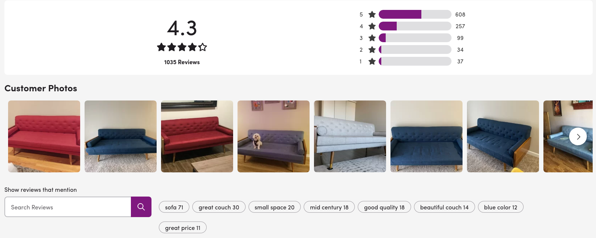

# extra-model

`extra-model` is an implementation of the `ExtRA` algorithm described in the paper ["ExtRA: Extracting Prominent Review Aspects from Customer Feedback"](https://www.aclweb.org/anthology/D18-1384). 

It is an unsupervised algorithm that implements an NLP task called [Aspect-Based Sentiment Analysis](https://paperswithcode.com/task/aspect-based-sentiment-analysis). 

At Wayfair this algorithm is routinely used in production on 1mln+ reviews to, e.g., produce what we call Bubble Filters: 



However, what we found in our work is that `extra-model` can be used to analyze any text, not only reviews, so we are hoping that with this package you'd be able to unlock the power of this algorithm in your work too.

## Examples

More examples are available [here](examples/examples.md)

## `extra-model` input

More info about the worklow is available [here](workflow.md)

Input of an extra is a `.csv` file with 2 columns: `CommentId` and `Comments`. 
Both must be present and named exactly in that way.

## `extra-model` output

After `extra-model` finishes calculations, it'll produce a `.csv` file with following structure:

```text
AdCluster,Aspect,AspectCount,CommentId,Descriptor,Position,SentimentBinary,SentimentCompound,Topic,TopicCount,TopicImportance,TopicSentimentBinary,TopicSentimentCompound,WordnetNode
only,downside,1,321,only,9,0.0,0.0,downside.n.01,1,0.005572645018795278,0.0,0.0,downside.n.01
more,nothing,1,74,more,54,0.0,0.0,nothing.n.01,1,0.005572645018795278,0.0,0.0,nothing.n.01
clean,bathrooms,1,146,clean,4,1.0,0.4019,toilet.n.01,1,0.005572645018795278,1.0,0.4019,toilet.n.01
decorated,place,5,146,decorated,32,0.0,0.0,home.n.01,6,0.03343587011277168,0.0,-0.01131666666666666,home.n.01
```

Columns have following meaning:

|Column                      | Description |
|:----------------------|:----------------------|
|AdCluster              |Adjectives are clustered together and this indicates the "center" of a cluster (e.g., "awesome", "fantastic", "great" descriptors might produce "great" as `AdCluster`)|
|Aspect                 |Identified aspect - this is an actual word that person wrote in a text|
|AspectCount            |How often this aspect has been found in all of the input|
|CommentId              |`ID` of an input. Since one input may produce multiple aspects, `ID` column must always be present|
|Descriptor             |Identified adjective (not clustered) - this is an actual word that person wrote in a text|
|Position               |Character number where aspect was found (e.g., "nice shirt" will have aspect "shirt" and `Position` 6|
|SentimentBinary        |Binary sentiment for aspect|
|SentimentCompound      |Compound sentiment for aspect|
|Topic                  |Collection of aspects.|
|TopicCount             |How often topic has been found in input|
|TopicImportance        |Importance of a topic|
|TopicSentimentBinary   |Similar to aspect, but on a topic level|
|TopicSentimentCompound |Similar to aspect, but on a topic level|
|WordnetNode            |Mapping to `wordnet` node. Identifiers in the form `.n.01` mean first meaning of the noun in `wordnet`| 
